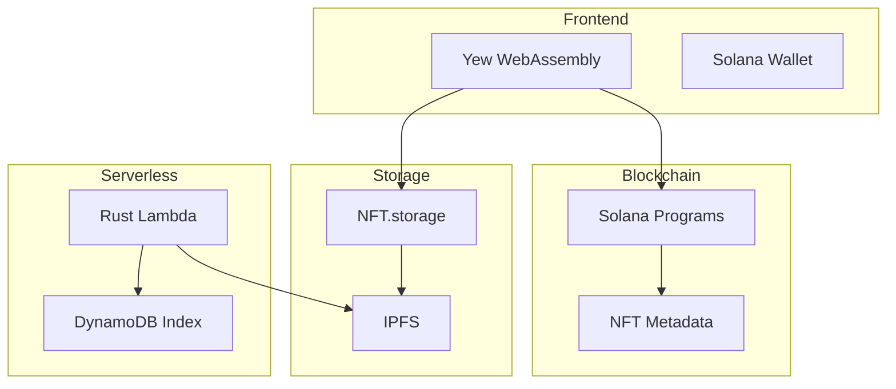

# f2t_logic
# Field 2 Table (f2t.io)

[](https://opensource.org/licenses/MIT)
[](http://makeapullrequest.com)
[](https://docs.solana.com/cli)
[](https://www.rust-lang.org/)

A decentralized marketplace revolutionizing local food commerce through blockchain-based farm shares, NFT-driven access control, and automated regulatory compliance.

## 🌟 Features

### Core Technologies
- 🔗 **Solana Smart Contracts** - Rust-based programs for farm share and compliance management
- 🎫 **Dynamic NFTs** - Metaplex-powered role and attribute management
- 🗃️ **NFT.storage** - Decentralized content storage with IPFS
- 🌐 **Yew Framework** - Rust-based WebAssembly frontend
- ⚡ **Serverless Rust** - AWS Lambda functions with custom runtime

### Key Components
- **Decentralized Storage** - IPFS-based permanent data availability
- **Farm Share Framework** - Legal structure enabling interstate commerce
- **Compliance Automation** - Real-time verification with NFT attributes
- **Zero-Trust Security** - Blockchain-verified access control

## 🚀 Getting Started

### Prerequisites
```bash
# Required versions
rustc 1.75.0 or higher
cargo 1.75.0 or higher
solana-cli 2.0.16
```

### Environment Setup
```bash
# Install Rust
curl --proto '=https' --tlsv1.2 -sSf https://sh.rustup.rs | sh

# Install Solana CLI
sh -c "$(curl -sSfL https://release.solana.com/v2.0.16/install)"

# Install WebAssembly tools
cargo install wasm-pack
cargo install trunk
rustup target add wasm32-unknown-unknown
```

### Development Setup
```bash
# Clone repository
git clone --recurse-submodules https://github.com/yourusername/f2t.git
cd f2t

# Install workspace dependencies
cargo build

# Configure environment
cp .env.example .env
# Edit .env with your configurations

# Start development server
trunk serve
```

## 🏗️ Project Structure

```
FlexnetGX/
├── GX-mobile/             # Mobile application development
│   ├── src/               # Mobile app source code
│   └── Cargo.toml         # Mobile dependencies
├── GX-web/                # Web application frontend
│   ├── src/               # Frontend source code (Yew WebAssembly)
│   └── Cargo.toml         # Frontend dependencies
├── GX-lambda/             # Serverless functions for backend
│   ├── src/               # Lambda function handlers
│   └── Cargo.toml         # Lambda dependencies
├── GX-blockchain/         # Blockchain programs
│   ├── farm_share/        # Solana program for farm shares
│   ├── access_control/    # NFT-based access control
│   └── Cargo.toml         # Blockchain dependencies
└── lib/                   # Shared Rust libraries
    ├── src/               # Common reusable code
    └── Cargo.toml         # Library dependencies
```

---

### Description of Categories:
1. **GX-mobile**:  
   - Mobile application for consumers and producers, likely built using a cross-platform Rust framework or native tools.  

2. **GX-web**:  
   - Web-based frontend application using the Yew framework with WebAssembly.  

3. **GX-lambda**:  
   - Serverless backend services hosted on AWS Lambda, handling APIs, compliance logic, and off-chain operations.  

4. **GX-blockchain**:  
   - Solana smart contracts for farm share management, access control, and compliance verification.  

5. **lib**:  
   - Shared libraries for common functionalities across `GX-mobile`, `GX-web`, and `GX-lambda`.


## 🔧 Development

### Smart Contract Development
```bash
# Build Solana programs
cargo build-bpf

# Run tests
cargo test-bpf

# Deploy program
solana program deploy target/deploy/farm_share.so
```

### Frontend Development
```bash
# Start Yew development server
trunk serve

# Build for production
trunk build --release
```

### Lambda Development
```bash
# Build Lambda functions
cargo lambda build

# Test locally
cargo lambda watch

# Deploy
cargo lambda deploy
```

### Local Development Dependencies
```toml
[workspace]
members = [
    "app",
    "programs/*",
    "lambda",
    "lib"
]

[workspace.dependencies]
yew = "0.21"
wasm-bindgen = "0.2"
solana-program = "1.17"
anchor-lang = "0.28"
```

## 📖 Documentation

- [System Architecture](./docs/architecture.md)
- [Access Control](./docs/accessControlSystem.md)
- [Smart Contracts](./docs/smartContracts.md)
- [AWS Integration](./docs/awsIntegration.md)
- [API Reference](./docs/apiReference.md)

## 📊 Technical Architecture



## 🤝 Contributing

See our [Contributing Guide](CONTRIBUTING.md) for:
- Development workflow
- Code standards
- Testing requirements
- Documentation guidelines

## 📜 License

This project is licensed under the MIT License - see the [LICENSE](LICENSE) file for details.

## 📞 Contact

- [Twitter](https://twitter.com/f2t_io)
- Email: support@f2t.io

---
Built with 🦀 Rust and ❤️ for local food communities